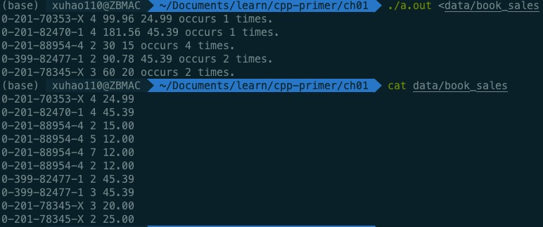
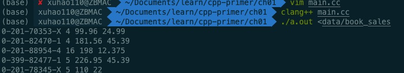

## 第一章开始

### 练习1.1

查阅你使用的编译器的文档，确定它所使用的文件命名约定。编译并运行第2页的程序


### 练习1.2

改写程序，让他返回-1。返回值-1通常被当做程序错误的标识。重新编译运行你的程序，观察你的系统如何处理main返回的错误标识。


### 练习1.3

编写程序，在标准输出上打印`Hello, World`。

```c++
#include <iostream>

int main()
{
  std::cout << "Hello, World" << std::endl;
  return 0;
}
```

### 练习1.4

我们的程序使用加法运算符+来将两个数相加。编写程序使用乘法运算符*，来打印两个数的积。

```c++
#include <iostream>

int main()
{
  std::cout << 1 * 2 << std::endl;
  return 0;
}
```

### 练习1.5

我们将所有输出操作放在一条很长的语句中。重写程序，将每个运算对象的打印操作放在一条独立的语句中。

```c++
#include <iostream>

int main()
{
    std::cout << "Enter two numbers:" << std::endl;
    int v1 = 0, v2 = 0;
    std::cin >> v1 >> v2;
    std::cout << "The sum of ";
    std::cout << v1;
    std::cout << " and ";
    std::cout << v2;
    std::cout << " is ";
    std::cout << v1 + v2;
    std::cout << std::endl;
    return 0;
}
```

### 练习1.6

解释下面程序片段是否合法。

```c++
std::cout << "The sum of " << v1;
					<< " and " << v2;
					<< " is " << v1 + v2 << std::endl;
```

如果程序是合法的，它输出什么？如果程序不合法，原因何在？应该如何修正？

不合法，因为语句中的分号将该语句分割成三个独立的语句，而后两条语句中`<<`操作符又没有`ostream`对象作为其左侧运算对象，编译失败。

可将多余的分号删除，使其成为一条语句。

```c++
std::cout << "The sum of " << v1
					<< " and " << v2
					<< " is " << v1 + v2 << std::endl;
```

### 练习1.7

编译一个包含不正确的嵌套注释的程序，观察编译器返回的错误信息

```c++
#include <iostream>
/*
 * /* This is a nested comment */
 */
int main()
{
    std::cout << "Hello, World" << std::endl;
    return 0;
}
```

错误信息


### 练习1.8

指出下列那些输出语句是合法的（如果有的话）：

```c++
std::cout << "/*";
std::cout << "*/";
std::cout << /* "*/" */;
std::cout << /* "*/" /* "/*" */;
```

预测编译这些语句会产生什么样的结果，实际编译这些语句来验证你的答案（编写一个小程序，每次将上述一条语句作为其主体），改正每个编译错误。

```c++
std::cout << "/*";  // 合法
std::cout << "*/";  // 合法
std::cout << /* "*/" */; //不合法
std::cout << /* "*/" /* "/*" */;  // 类似于cout << " /* "
```

第三条不合法，错误信息如下


### 练习1.9

编写程序，使用while循环将50到100的整数相加

```c++
#include <iostream>
int main()
{
  int i = 50, sum = 0;
  while (i <= 100)
    sum += i++;
  std::cout << sum << std::endl;
}
```

### 练习1.10

除了++运算符将运算对象的值增加1之外，还有一个递减运算符(--)实现将值减少1。编写程序，使用递减运算符在循环中按递减顺序打印出10到0之间的整数。

```c++
#include <iostream>
int main()
{
    int num = 10;
    while (num >= 0)
        std::cout << num-- << std::endl;
    return 0;
}
```

### 练习1.11

编写程序，提示用户输入两个整数，打印出这两个整数所指定的范围内的所有整数。

```c++
#include <iostream>
int main()
{
    int a = 0, b = 0;
    std::cout << "Please enter two numbers: " << std::endl;
    std::cin >> a >> b;
    if (a > b)
    {
        a = a + b;
        b = a - b;
        a = a - b;
    }
    while (a <= b)
        std::cout << a++ << std::endl;
    return 0;
}
```

### 练习1.12

下面的for循环完成了什么功能？sum的终值是多少？

```c++
int sum = 0;
for (int i = -100; i <= 100; ++i)
  sum += i;
```

从-100累加到100，终值为0

### 练习1.13

使用for循环重做1.4.1节中的所有练习（第11页）

```c++
// 练习1.9
#include <iostream>
int main()
{
    int sum = 0;
    for(int i = 50; i <= 100; ++i)
        sum += i;
    std::cout << sum << std::endl;
    return 0;
}
// 练习1.10
#include <iostream>
int main()
{
    for(int i = 10; i >= 0; --i)
        std::cout << i << std::endl;
    return 0;
}
// 练习1.11
#include <iostream>
int main()
{
    int a = 0, b = 0;
    std::cout << "Enter two numbers" << std::endl;
    std::cin >> a >> b;

    if (a > b)
    {
        a = a + b;
        b = a - b;
        a = a - b;
    }
    for(int i = a; i <= b; ++i)
        std::cout << i << std::endl;
    return 0;
}
```

### 练习1.14

对比for循环和while循环，两种形式的优缺点各是什么？

>The difference is that the do while loop executes at least once because it checks for the loop condition while exiting. While is a entry controlled loop and do while is a exit control loop. Whereas in do while loop it will enter the loop and will then check for the condition.
>
>**while loop** - used for looping until a condition is satisfied and when it is unsure how many times the code should be in loop
>
>**for loop** - used for looping until a condition is satisfied but it is used when you know how many times the code needs to be in loop
>
>**do while loop** - executes the content of the loop once before checking the condition of the while.

More in [whats the difference between while and for](https://stackoverflow.com/questions/32562212/whats-the-difference-between-while-and-for)

### 练习1.15

编写程序，包含第14页“再探编译”中讨论的常见错误。熟悉编译器生成的错误信息。

编译器可以检查多种类型错误

* 语法错误(syntax error)
* 类型错误(type error)
* 声明错误(declaration error)

### 练习1.16

编写程序，从cin读取一组数，输出其和

```c++
#include <iostream>
int main()
{
    int a = 0, sum = 0;
    while (std::cin >> a)
        sum += a;
    std::cout << sum << std::endl;
    return 0;
}
```

### 练习1.17

如果输入的所有值都是相等的，本节的程序会输出什么？如果没有重复值，输出又会是怎样的？

若所有值都相等，则输出该值及其次数。所没有重复值，则所有值依次输出，次数为1

### 练习1.18

编译并运行本节的程序，给它输入全都相等的值。再次运行程序，输入没有重复的值。

```c++
#include <iostream>
int main()
{
    int currVal = 0, val = 0;

    if (std::cin >> currVal)
    {
        int cnt = 1;
        while(std::cin >> val)
        {
            if (currVal == val)
                ++cnt;
            else
            {
                std::cout << currVal << " occurs " << cnt << " times" <<std::endl;
                currVal = val;
                cnt = 1;
            }
        }
        std::cout << currVal << " occurs " << cnt << " times" <<std::endl;
    }
    return 0;
}
```


### 练习1.19

修改你为1.4.1节练习1.10（第11页）所编写的程序（打印一个范围内的数），使其能处理用户输入的第一个数比第二个数小的情况。

题目叙述错误，是练习1.11，且当时做练习1.11时已经处理本练习所描述情况，请看练习1.11

### 练习1.20

在网站http://www.informit.com/title/032174113 上，第1章的代码目录包含了头文件 Sales_item.h。将它拷贝到你自己的工作目录中。用它编写一个程序，读取一组书籍销售记录，将每条记录打印到标准输出上。

```c++
#include <iostream>
#include "Sales_item.h"
int main()
{
    Sales_item a;
    while(std::cin >> a)
        std::cout << a << std::endl;
    return 0;
}
```

### 练习1.21

编写程序，读取两个ISBN相同的`Sales_item`对象，输出他们的和。

```c++
#include <iostream>
#include "Sales_item.h"

int main()
{
    Sales_item a, b;
    std::cin >> a >> b;
    std::cout << a + b << std::endl;
    return 0;
}
```

### 练习1.22

编写程序，读取多个具有相同ISBN的销售记录，输出所有记录的和。

```c++
#include <iostream>
#include "Sales_item.h"

int main()
{
    Sales_item sum, tmp;
    std::cin >> sum;
    while (std::cin >> tmp)
        sum += tmp;
    std::cout << sum << std::endl;
    return 0;
}
```

### 练习1.23

编写程序，读取多条销售记录，并统计每个ISBN（每本书）有几条销售记录。

```c++
#include <iostream>
#include "Sales_item.h"

int main()
{
    Sales_item val, currVal;
    if (std::cin >> currVal)
    {
        int cnt = 1;
        while (std::cin >> val)
        {
            if (currVal.isbn() == val.isbn())
                ++cnt;
            else
            {
                std::cout << currVal << " occurs " << cnt << " times." << std::endl;
                currVal = val;
                cnt = 1;
            }
        }
        std::cout << currVal << " occurs " << cnt << " times." << std::endl;
    }
    return 0;
}
```

### 练习1.24

输入表示多个ISBN的多条销售记录来测试上一个程序，每个ISBN的记录应该聚在一起。



### 练习1.25

借助网站上的`Sales_item.h`头文件，编译并运行本节给出的书店程序




