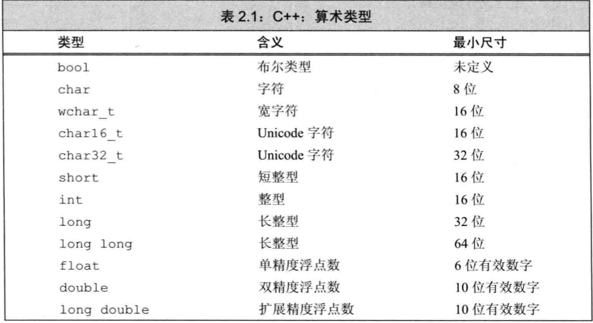
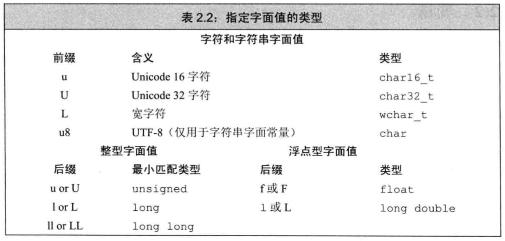

## 第二章 变量和基本类型

### 基本内置类型

C++基本数据类型包括**算数类型(arithmetic type)**和**空类型(void)**，算数类型包含**字符、整形数、布尔值和浮点数**。空类型不对应具体指，仅用于某些特殊场合。

#### 算数类型

算数类型分为两类：**整形(integral type，包括字符和布尔类型在内)**和**浮点型**



- 布尔类型(bool) 取值是 真(true)或 假(false)
- C++语言规定 `short <= int <= long <= longlong`， `long long`为C++11新特性
- 计算机中可寻址的最小内存块为**字节(byte)**， 存储的基本单元称为**字(word)** [字节、位、字长](https://www.kancloud.cn/chandler/programming_road/695584)
- 浮点型可表示单精度、双精度和扩展精度值，分别对应`float`, `double`和`long double`。`float`和`double`分别有`7`和`16`个有效位，而`long double`则根据具体实现不同
- 除布尔型和扩展字符型之外，其他整形可划分为**带符号(signed)**和**无符号(unsigned)**两种，带符号类型可表示正数、负数或0，而无符号类型仅能表示大于等于0的值；默认`short, int, long, longlong`都是带符号类型，通过在前面添加`unsigned`得到无符号类型，比如`unsigned long`，默认`unsigned int`可缩写为`unsigned`

**类型选择建议**

- 当明确知晓数值不可能为负时，选用无符号类型
- 使用`int`执行整数运算，若数值超过`int`表示范围，选用`long long`，因为`long`一般与`int`尺寸一样
- 算术表达式中不要使用`char`或`bool`，只有在存放字符或布尔值时才使用。因为`char`在某些机器为有符号，而在某些机器又是无符号，很容易出问题，除非指定`unsigned char`或`signed char`
- 执行浮点数运算用`double`，因为`float`通常精度不够且双精度浮点数和单精度浮点数计算代价相差无几，有时还快。`long double`一般不必要，且其运行时消耗不容忽视

#### 类型转换

不同类型之间运算，会自动转换对象类型为另一种相关类型

* 非布尔类型值赋给布尔类型时，初始值为0时转换为false，否则为true
* 布尔值赋给非布尔类型时，初始值为false时转换为0，否则为1
* 浮点数赋给整数类型时，进行近似处理，仅保留浮点数中小数点前的部分
* 整数值赋给浮点类型时，小数部分记为0，若该整数所占空间超过浮点类型容量，精度会损失
* 赋给无符号类型一个超出其表示范围的值时，结果是初始值对无符号类型表示数值总数取模后的余数。比如8比特大小的unsigned char可最大表示255，最后结果为值对255取模后的余数
* 赋给带符号类型一个超出其表示范围的值时，结果是**未定义的(undefined)**

**建议：避免无法预知和依赖于实现环境的行为**

**提示：切勿混用带符号类型和无符号类型**

```c++
// 当算法表达式中存在无符号数和int时，int会转换为无符号数
unsigned u = 10;
int i = -42;
std::cout << i + i << std::endl;  // 输出-84
std::cout << u + i << std::endl;  // 如果int占32位，输出4294967264

// 无符号数减法，必须确保结果不可能为负值, 如下例错误，变量u永远不会小于0，故会死循环
for (unsigned u = 10; u >= 0; --u)
  std::cout << u << std::endl;
```

#### 字面值常量

每个字面值常量都对应一种数据类型，字面值常量的形式和值决定其数据类型

* 整型字面值可写作十进制数、八进制数或十六进制数形式。`0`开头整数表示八进制数，`0x`或`0X`开头整数表示十六进制数

* 浮点型字面值表现为一个小数或以科学计数法表示的指数，指数部分用`E`或`e`标识，默认浮点型字面值为`double`

* `char`型字面值为单引号括起来的一个字符；字符串型字面值为双引号括起来的零个或多个字符；字符串型字面值的类型实际上是由常量字符构成的数组（array），编译器会在每个字符串结尾处添加一个空字符(`'\0'`)，故其长度比起内容多1

* 有两类字符程序员无法直接使用，一是**不可打印**字符，比如退格符或其他控制字符；二是**特殊含义**字符，比如单引号、双引号、问号等，需用到**转义序列**转义才可使用，比如`\n`换行符

* 添加前缀和后缀，可改变整型、浮点型和字符型字面值的默认类型；比如`L'a'`为宽字符型字面值，类型是`wchar_t`

  

* 布尔字面值即`true`和`false`，而指针字面值即`nullptr`

### 变量

#### 定义和声明

* **定义** 定义规定了变量的类型和名字，且申请了存储空间，还可以为变量赋初值

* **声明** 声明仅规定了变量的类型和名字
* **extern** 用来声明变量，但是不可显式初始化，否则即变为定义；`extern`还表示该变量定义在别处
* **变量能且只能被定义一次，但是可以被多次声明**
* **声明和定义区别很重要，若要在多个文件中使用同一个变量，则需将声明和定义分离，此时定义只能出现在一个文件中，其他文件中可进行声明，但绝对不能重复定义**

#### 初始化和赋值

* **对象初始化(initialized)** 创建变量时赋予其初始值
* **赋值** 将已存在的对象的当前值擦除，并以新值替代
* **初始化不是赋值**
* **列表初始化** 使用一组由花括号括起来的初始值初始化对象或某些情况为对象赋新值；**注意** 如果使用列表初始化且初始值存在丢失信息的风险，编译器将报错。
* **默认初始化** 若定义变量时未指定初值，则变量被默认初始化。函数体内部的内置类型变量将不被初始化

#### 作用域

* **全局作用域global scope**： 定义在函数体之外的名字，整个程序范围内都有效
* **块作用域block scope**： 定义在某个块内，比如函数体内等
* **建议：当第一次使用变量时再定义它，这样更容易找到变量定义，且越近初始值越合理**
* **嵌套作用域**： 作用域能彼此包含，被包含或被嵌套的作用域称为**内层作用域inner scope**， 包含其他作用域的作用域称为**外层作用域outer scope**
* **全局变量与局部变量不要同名**

### 复合类型

#### 引用

* 引用非对象，其为已存在对象的别名，故无法定义引用的引用
* 引用定义时，会绑定到已存在对象，而不是将初始值拷贝给引用
* **引用必须初始化，无法重新绑定**
* 引用只能绑定对象，无法绑定到字面值或某个表达式的计算结果
* **右值引用(rvalue reference)**：C++11新增，主要用于内置类；术语**引用**默认为**左值引用(lvalue reference**

#### 指针

* **指针(pointer)**是指向另外一种类型的复合类型，实现了对其他对象的间接访问
* 指针是对象，允许对指针赋值和拷贝，且在生命周期内可先后指向不同对象
* 指针无需在定义时赋初值，与其他内置类型一样，块作用域内定义的指针若没被初始化，值不确定
* 指针存放的是某个对象的地址，可使用**取地址符(&)**获取地址
* 引用不是对象，故无法定义指向引用的指针
* 指针的值（即地址）应属于以下4种状态
  * 指向一个对象
  * 指向紧邻对象所占空间的下一个位置
  * 空指针，意味着指针没有指向任何对象
  * 无效指针，也就是上述情况之外的其他值
* **解引用符(*)**可访问指针指向的对象
* **空指针(null pointer)**不指向任何对象，使用指针前首先检查是否为空。`C++11`推荐使用`nullptr`字面值初始化空指针，`NULL`是一个**预处理变量**，定义在`cstdlib`中
* **建议：初始化所有指针**
* `void*`是一种特殊的指针类型，可用于存放任意对象的地址

#### 理解复合类型的声明

**指向指针的指针**

指针也是内存中的对象，也有自己的地址，故可将指针的地址存放到另一个指针中。当然解引用指向指针的指针会得到一个指针，若要获取最原始的int对象，需要解引用两次

```c++
int ival = 1024;
int *pi = &ival;  // pi 指向一个 int 型的数
int **ppi = &pi;  // ppi 指向一个 int 型指针
```

**指向指针的引用**

引用本身不是对象，故无法定义指向引用的指针。但指针是对象，所以存在对指针的引用。

```c++
int i = 42;
int *p;  // p 是一个 int 型指针
int *&r = p;  // r 是一个对指针 p 的引用

r = &i;  // r 引用了指针 P, 故给 r 赋值 &i 就是令 p 指向 i
*r = 0;  // 解引用 r 得到 i，也就是 p 指向的对象，将 i的值改为 0
```

理解类型最简单的办法是**从右向左**阅读定义，比如上例中`r`，离变量名最近的符号为`&`，表示`r`是一个引用，`*`表示`r`引用的是一个指针，`int`表示`r`引用的是一个`int`指针

### const限定符

const用来定义不被改变的变量，即可将变量定义为常量

* const对象必须初始化，初始化可以是任意复杂的表达式

* const类型对象只能执行不改变其内容的操作

* 默认状态下，const对象仅在文件内有效。如果想要在多文件中共享const对象，则必须在声明和变量前都添加`extern`关键字

* **对常量的引用** 简称**常量引用**, `const int ci = 1024; const int &r1 = ci;`

* 初始化常量引用时，允许用任意表达式作为初始值，只要该表达式的结果能转换成引用的类型即可，允许为一个常量引用绑定非常量对象、字面值或者表达式

* **指向常量的指针** `const double pi = 3.14; const double* cptr = &pi;`

* 指向常量的指针的类型应与所指对象类型一致，但有两个例外；其一为允许指向常量的指针指向非常量对象；

* **const指针** 又称为**常量指针**，指针本身为常量，必须初始化，且不可更改指针指向

* ```c++
  int errNumb = 0; 
  int *const curErr = &errNumb;  // curErr 是指向 errNumb的const指针
  const double pi = 3.14159;
  const double *const pip = &pi;  // pip是指向const对象pi的const指针
  ```

* 类型需从右向左读

  > const double* cptr = & pi;  // 表示cptr为一个指针，指向 const double类型对象
  >
  > int * const curErr = &errNumb;  // 表示curErr 为一个const指针，指向int类型对象

* **顶层const (top-level const)** 表示指针本身是常量

* **底层const (low-level const)** 表示指针所指对象是常量

  ```c++
  int i = 0;
  int *const pi = &i;       // 顶层const，pi为const指针，指向int类型对象
  const int ci = 42;        // 顶层const，ci为const int类型对象
  const int *p2 = &ci;      // 底层const，p2为指针，指向const int类型对象
  const int *const p3 = p2; // 右侧const为顶层const，表示p3为const指针，左侧为底层const，表示指向const int类型对象
  const int &r = ci;  // 底层const，用于声明引用的const都是底层const
  ```

#### constexpr和常量表达式

* **常量表达式(const expression)**是指值不会改变并且在编译过程就能得到计算结果的表达式。字面值属于常量表达式，用常量表达式初始化的const对象也是常量表达式

* 一个对象（或表达式）是否为常量表达式由其数据类型和初始值功能决定

  ```c++
  const int max_files = 20;        // max_files 是常量表达式
  const int limit = max_files + 1; // limit 是常量表达式
  int staff_size = 27;             // staff_size 不是常量表达式
  const int sz = get_size();       // sz不是常量表达式
  ```

* **constexpr** C++11规定允许将变量声明为**constexpr**类型，以便由编译器来验证变量是否为常量表达式

* **constexpr**变量一定是个常量，必须由常量表达式或`constexpr`函数（一种足够简单能在编译器计算结果的函数）初始化

  ```c++
  constexpr int mf = 20;        // 20 是常量表达式
  constexpr int limit = mf + 1; // mf + 1 是常量表达式
  constexpr int sz = size();    // 当size()为constexpr函数时，才为正确声明语句
  ```

* **constexpr指针**的初始值必须是`nullptr`或者0，或者是存储于某个固定地址中的对象

* 定义于所有函数体之外的对象其地址固定不变，可用来初始化`constexpr`指针；

* 6.1.1节中，有一类变量，可超出其函数定义本身，也有固定地址，可用来初始化`constexpr`指针；填坑后续

* **constexpr**把它所定义的对象置为了顶层const

### 处理类型

#### 类型别名(Type Alias)

类型别名为某种类型的同义词，可简化复杂类型

* **typedef** 传统方法定义类型别名

  ```c++
  typedef double wages;  //wages 是 double 的同义词
  typedef wages base, *p;  // base 是 double 的同义词，p是double*的同义词
  ```

* **using** C++11

  ```c++
  using SI = Sales_item;  // SI 是 Sales_item 的同义词
  ```

* **Note** 不要错误的尝试把类型别名替换成原来的样子来理解含义，容易错误理解

  ```c++
  typedef char *pstring;
  const pstring cstr = 0;  // cstr 是指向char 的常量指针
  const pstring *ps;       // ps 是一个指针，指向char的常量指针
  ```

#### auto类型说明符

C++11引入`auto`类型说明符，通过编译器分析表达式所属类型

* **auto**通过初始值推算变量类型，故auto定义的变量必须有初始值

* **auto**可在一条语句中声明多个变量，但所有变量的初始基本数据类型都一致；切记`&`和`*`不是基本类型的而一部分

* 引用作为auto变量初始值时，类型为引用对象的类型

  ```c++
  int i = 0, &r = i;
  auto a = r;  // a 是一个整型
  ```

* auto会忽略顶层const，保留底层const；若希望推断出的auto类型为顶层const，则需要明确指出

  ```c++
  const int ci = i, &cr = ci;
  auto b = ci;  // b为整型，ci的顶层const特性呗忽略
  auto e = &ci;  // e是一个指向整数常量的指针
  const auto f = ci;  // f 为 const int
  ```

* auto引用会保留初始值中的顶层const特性，即此时的常量不是顶层常量

#### decltype类型说明符

C++11引入`decltype`类型说明符，其作用是选择并返回操作数的数据类型，但并不实际计算

* decltype处理顶层const和引用的方式与auto不同。若decltype使用的表达式是一个变量，则decltype返回该变量的类型（包括顶层const和引用在内）; 如果decltype使用的是一个不加括号的变量，则得到的结果就是该变量的类型；如果给变量加上了一层或多层括号，编译器会将其当成一个表达式，则得到引用类型。
* 若decltype使用的表达式不是一个变量，则decltype返回表达式结果对应的类型；如果表达式为解引用操作，则decltype将得到引用类型；

### 自定义数据结构

* 类的花括号为一个新作用域
* 类体右侧即最后必须写分号，因为类体或可紧跟变量名以示对该类型对象的定义，当然不建议这样定义；
* C++11规定，可为数据成员提供类内初始值(in-class initializer)，无初始值的成员将被默认初始化
* 头文件通常包含只能被定义一次的实体，比如类、const和constexpr变量
* 头文件保护符(header guard)依赖于预处理变量。预处理变量有两种状态：已定义和未定义。`#define`指令定义预处理变量，`#ifdef`和`#ifndef`判断检查变量，遇`#endif`结束
* 头文件保护符和`#progma once`都可以有效防止头文件重复包含的问题
* 预处理变量无视C++语言中关于作用域的规则