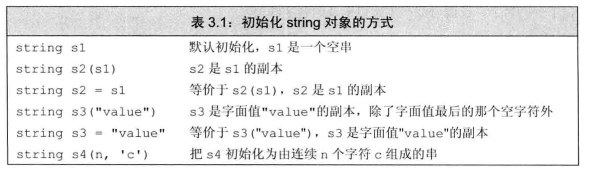
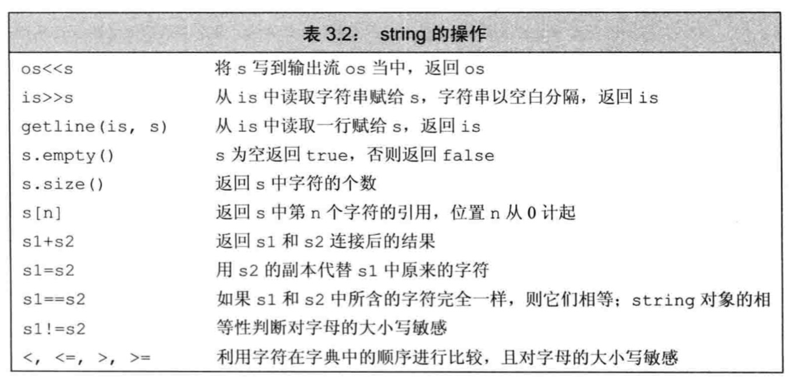

字符串、向量和数组

命名空间的using声明

* 作用域操作符`::`，表示从操作符左侧名字所示的作用域中寻找右侧名字

* `using声明` 使用using声明可引入命名空间的名字

  ```c++
  using namespace::name;
  using std::cout;
  ```

* 每个名字都需要独立的using声明

* 头文件不应包含using声明


标准库类型string

标准库类型`string`表示可变长的字符序列，使用string类型必须首先包含string头文件，string是标准库一部分，定义在命名空间std中

```c++
#include <string>
using std::string;
```

定义和初始化string对象

类对象初始化方式由类控制，可有多种，但必须有所区别，比如初始值数量不同、类型不同等



直接初始化和拷贝初始化

* 拷贝初始化(copy initialization)：使用`等号(=)`初始化变量，编译器把等号右侧的初始值拷贝到新创建的对象中去
* 直接初始化(direct initialization)：不使用等号

```c++
string s1 = "hh";  // 拷贝初始化
string temp("hh");  // 上面语句等同于该下两条语句
string s1 = temp;  

string s2("hh");  // 直接初始化
```

string对象上的操作

类除了规定初始化其对象的方式外，还定义了对象所能执行的操作



* 读写string对象 `cin >> s;` 注意读取string对象时会自动忽略开头的空白字符（比如空格符、换行符、制表符）等

* 读取未知数量的string对象 

  ```c++
  string word;
  while(cin >> word)  // 遇到文件结束标记或非法输入即退出循环
  	cout << word << endl;
  ```

* 使用getline读取一整行

  ```c++
  string line;
  while(getlie(cin, line))  // 换行符触发结束读取该行，换行符会被丢弃
  	cout << line << endl;
  ```

* **`empty()`**string为空返回true

* **`size()`** 返回string对象的长度

* **`string::size_type`**, size()返回值类型，无符号整数类型

  >  string类及其他标准库类型定义的配套类型之一，体现了标准库类型与机器无关的特性；切记，不要混用无符号类型和有符号类型

* **比较** `==, !=, <, <=, >, >=` 用来检验比较string对象，运算符按照大小写敏感的字典顺序

* **赋值** `s1 = s2` 与内置类型一致

* **`+, +=`** string对象之间支持加法运算符，复合赋值运算符；

* 字面值和string对象也可相加，因为标准库允许把字符字面值和字符串字面值转换为string对象，要确保加法元素安抚中至少有一个运算对象是string

  ```c++
  string s = "hello" + "world";  // 错误，两个运算对象都不是string
  ```

* 字符串字面值与标准库类型string是不同的类型