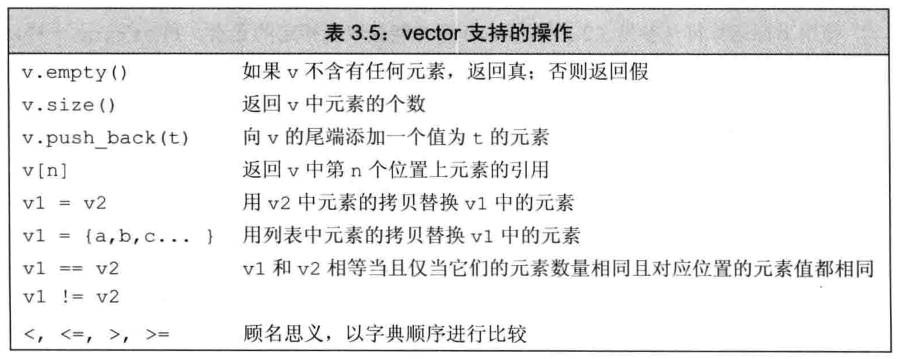

字符串、向量和数组

命名空间的using声明

* 作用域操作符`::`，表示从操作符左侧名字所示的作用域中寻找右侧名字

* `using声明` 使用using声明可引入命名空间的名字

  ```c++
  using namespace::name;
  using std::cout;
  ```

* 每个名字都需要独立的using声明

* 头文件不应包含using声明


标准库类型string

标准库类型`string`表示可变长的字符序列，使用string类型必须首先包含string头文件，string是标准库一部分，定义在命名空间std中

```c++
#include <string>
using std::string;
```

定义和初始化string对象

类对象初始化方式由类控制，可有多种，但必须有所区别，比如初始值数量不同、类型不同等


直接初始化和拷贝初始化

* 拷贝初始化(copy initialization)：使用`等号(=)`初始化变量，编译器把等号右侧的初始值拷贝到新创建的对象中去
* 直接初始化(direct initialization)：不使用等号

```c++
string s1 = "hh";  // 拷贝初始化
string temp("hh");  // 上面语句等同于该下两条语句
string s1 = temp;  

string s2("hh");  // 直接初始化
```

string对象上的操作

类除了规定初始化其对象的方式外，还定义了对象所能执行的操作


* 读写string对象 `cin >> s;` 注意读取string对象时会自动忽略开头的空白字符（比如空格符、换行符、制表符）等

* 读取未知数量的string对象 

  ```c++
  string word;
  while(cin >> word)  // 遇到文件结束标记或非法输入即退出循环
  	cout << word << endl;
  ```

* 使用getline读取一整行

  ```c++
  string line;
  while(getlie(cin, line))  // 换行符触发结束读取该行，换行符会被丢弃
  	cout << line << endl;
  ```

* **`empty()`**string为空返回true

* **`size()`** 返回string对象的长度

* **`string::size_type`**, size()返回值类型，无符号整数类型

  >  string类及其他标准库类型定义的配套类型之一，体现了标准库类型与机器无关的特性；切记，不要混用无符号类型和有符号类型

* **比较** `==, !=, <, <=, >, >=` 用来检验比较string对象，运算符按照大小写敏感的字典顺序

* **赋值** `s1 = s2` 与内置类型一致

* **`+, +=`** string对象之间支持加法运算符，复合赋值运算符；

* 字面值和string对象也可相加，因为标准库允许把字符字面值和字符串字面值转换为string对象，要确保加法元素安抚中至少有一个运算对象是string

  ```c++
  string s = "hello" + "world";  // 错误，两个运算对象都不是string
  ```

* 字符串字面值与标准库类型string是不同的类型

处理string对象中的字符

* cctype中定义了一组标准库函数处理字符

  

* c++标准库除了定义c++特有功能外，还兼容C语言的标准库，其形式为`cname`, 比如`cctype`

* 范围for语句(range for) c++11提供

  ```c++
  for(declaration : expression)
  	statement
  string str("some string");
  for(auto c : str)
    cout << c << endl;
  ```

* **`下标运算符[]`** 参数类型为`string::size_type`，返回值是该位置上字符的引用，注意检查下标合法性

标准库类型vector

标准库类型vector表示对象集合，其中所有对象的类型相同，使用前先引入和声明

```c++
#include <vector>
using std::vector;
```

* c++ 中既有类模板也有函数模板，vector为类模板；编译器根据模板创建类或函数的过程称为实例化，实例化时需要指定类型

* 注意，老版编译器可能需要老式声明语句，类似`vector<vector<int> >`, c++11可不添加空格

* 定义和初始化vector对象

  

* 列表初始化 `vector<string> articles = {"a", "an", "the"}; `

* 初始化例外情况

  * 拷贝初始化即使用=时，只能提供一个初始值
  * 如果提供的是一个类内初始值，则只能使用拷贝初始化或使用花括号的形式初始化
  * 如果提供的是初始值列表，则只能放在花括号里进行列表初始化，不能放在圆括号

* 值初始化  `vector<int> ivec(10);`

  * 有些类要求必须明确提供初始值，若类中元素类型不支持默认初始化，则必须提供初始值；
  * 如果只提供元素数量，而没有设定初始值，则只能使用直接初始化

* 若初始化时使用了花括号形式，但提供的值又不能进行列表初始化，则编译器会考虑按照圆括号形式构造对象

  ```c++
  vector<string> v5{"hi"}; // 列表初始化，v5有一个元素
  vector<string> v6("hi"); // 错误，不能使用字符串字面值构建vector对象
  vector<string> v7{10}; // v7有10个默认初始化的元素
  vector<string> v8{10, "hi"}; // v8有10个值为"hi"的元素
  ```

* **`push_back`** 向vector对象中添加元素 

* 范围for语句体内不应改变其遍历序列的大小

其他vector操作



* 使用size_type需要首先指定它的类型定义，vector对象的类型总是包含元素的类型 `vector<int>::size_type`


迭代器介绍

迭代器与下标运算符类似，但更通用，少数几种容器支持下标，但所有标准库容器都支持迭代器

* 迭代器可访问容器中元素，迭代器有有效和无效之分，有效的迭代器或者指向某元素，或者指向尾元素的下一位置，其他情况均为无效

* 容器中`begin()`返回指向第一个元素的迭代器，`end()`返回指向容器尾元素的下一个位置的迭代器。即，该迭代器表示的是一个额不存在的**尾后(off the end)**元素，被称为尾后迭代器

* 容器为空时，则`begin`和`end`返回的是同一个迭代器，都是尾后迭代器

* 迭代器比较运算符

  

* 对迭代器执行递增或解引用操作时，必须保证迭代器实际指向某元素。尾后迭代器并不实际指向，故同样不行

* 迭代器类型

  * `vector<int>::iterator it;` , `string::iterator it2`
  * `vector<int>::const_iterator it3; `, `string::const_iterator it4`

